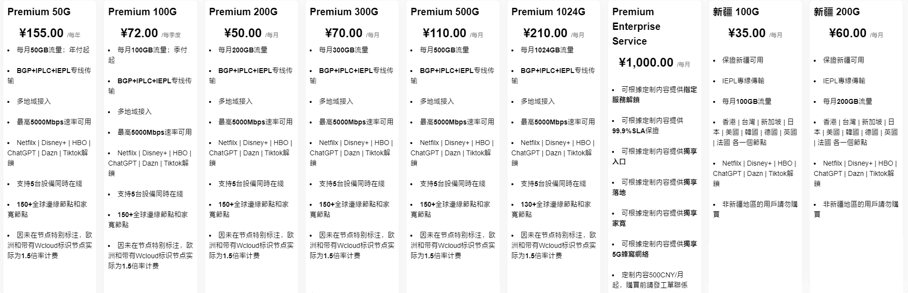
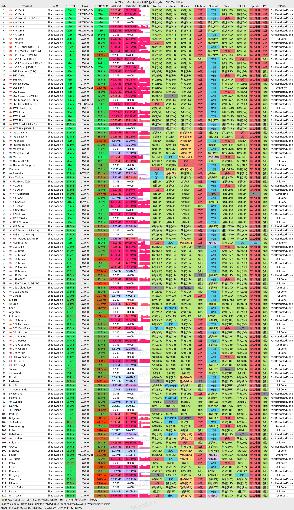

# MESL机场怎么样？MESL机场官网地址+优惠码更新...

永久官网：[https://in.mesl.cloud](https://xuv.cc/out/ml)

直连地址1：[https://cdn.meslcloud.com](https://cdn.meslcloud.com/#/register?code=PrDktdg6)

> MESL 是一家创立于2022年，到目前也算是老牌机场了。Shadowsocks 专线机场，国内入口有多线 BGP 机房，IEPL 专线数据传输，MESL 机场可稳定解锁 Netflix、Disney+ 以及 ChatGPT。线路比较丰富，流媒体解锁不错，阿里电信移动等入口。

## MESL机场怎么样？

最近上线了新疆专用的套餐，和普通套餐的区别在于入口、落地不同，节点少很多，并且价格更贵，仅适合当地用户。

常用地区节点的速度和解锁表现都不错，部分节点使用倍率较高，当然也有低倍率节点可用。

YouTube 4K 流畅观看，晚高峰也比较流畅。

测试了 Netflix、Disney+ 解锁，日常使用稳定性也不错。测试 ChatGPT 解锁表现不错。

### MESL机场特色

>支持 Clash、Shadowrocket、Stash、Quantumult X、Surge 等订阅一键导入。
>
>付款方式支持支付宝和USDT加密货币。
>
>IEPL 专线机场
>
>多线 BGP 入口

## MESL机场优惠码

MESL最近优惠码，Christmas 欢庆圣诞，温暖相伴，全场85折优惠。

优惠码：[15%OFF](https://xuv.cc/out/ml)

> 注意：Premium 50G不參與優惠活動

## MESL机场优惠套餐价格

| MESL机场 | 付款周期 | 价格     | 每月流量    | 同时在线数量 |
|--------|------|--------|---------|--------|
| 200G   | 按月付  | 50.00  | 200 GB  | 5      |
| 300G   | 按月付  | 70.00  | 350 GB  | 5      |
| 500G   | 按月付  | 110.00 | 500 GB  | 5      |
| 1024G  | 按月付  | 210.00 | 1024 GB | 5      |
| 50G    | 按年付  | 55.00  | 50 GB   | 5      |
| 100G   | 按季付  | 72.00  | 100 GB  | 5      |

## MESL机场机场测速

## MESL机场跑路了吗？

目前MESL机场没有跑路，注意控制充值时长，防范风险即可。
